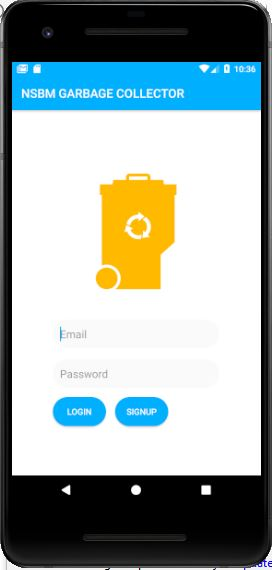
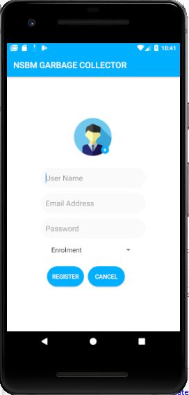
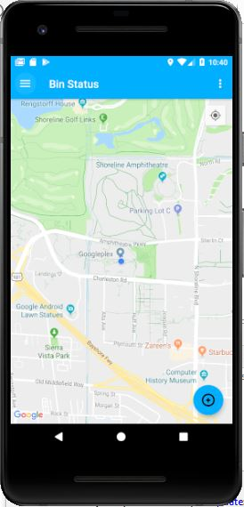

# Garbage-Collector-Mobile-App

In this mobile app was developed by using the android studio. Therefore main development program language is java.  There are few API’s connected with the backend. 

## Overview of garabage app.

There is mainly three users for the system.
1.Cleaning staff employee
2.Students of the university
This app was useful to the cleaning staff, because they can track the level of the garbage inside the trash bins. and also useful to the students to find the bins around the premises.

## Google Maps API

This was used to show the garbage bins around the area. And indicate their garbage level in each bin. Not only that user was indicate the app and ,he/she can find easily garbage bins around the university premises.

## Google firebase Auth.

This will helps to authenticate the user login crendentials. We can easily mange the user sign ups using the google firebase. And database part was handle by using the firebase database.

## Login Page

Before Proceed to main page , user must login to the application. Login process was handle by using the google firebase authentication. 

 

## Sign-up page 

Any user that new to the system , he/she must register the system using valid credentials. This part was also connected with the google firebase authentication.

 

## Main Page

This was the main page after successfull login. user can view the garbage bin near to his position.

 